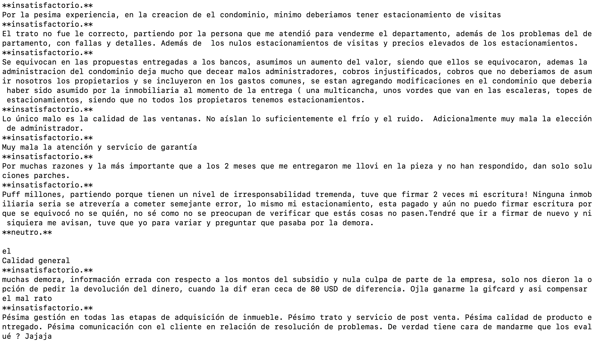
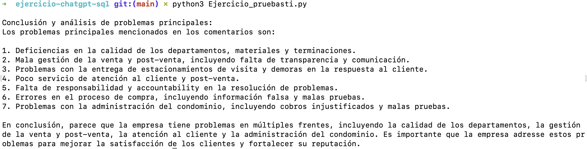

# Ejercicio de prueba de programacion usando chat GPT, MySQL, Pandas, Numpy Y Matplotlib 

El objetivo es leer una tabla en MySql y procesarla usando librerias de python y devolver imagenes y datos.

